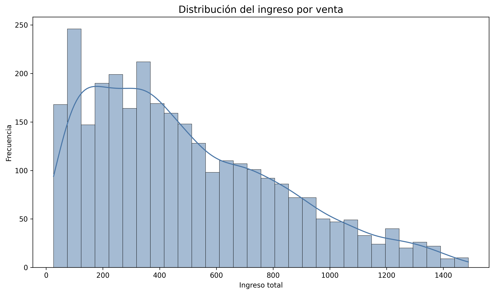
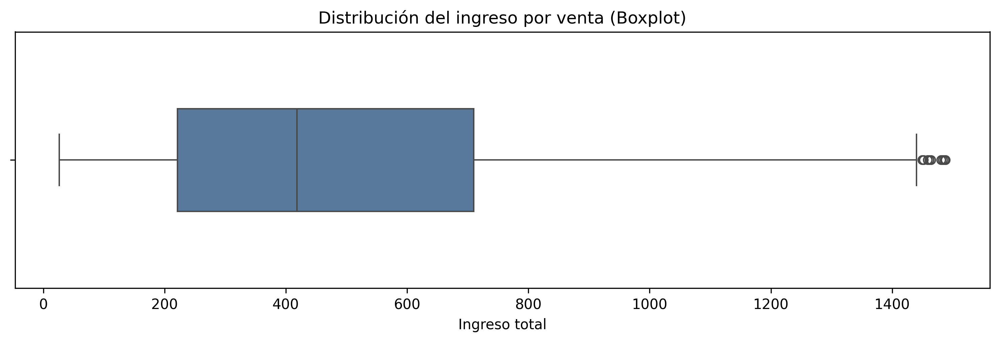
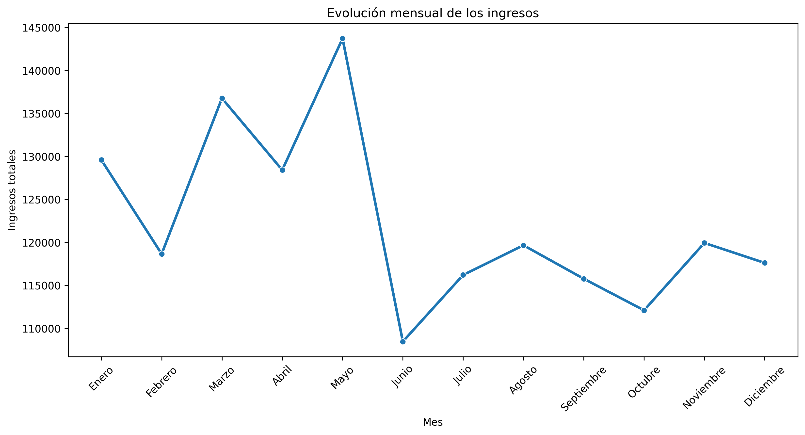
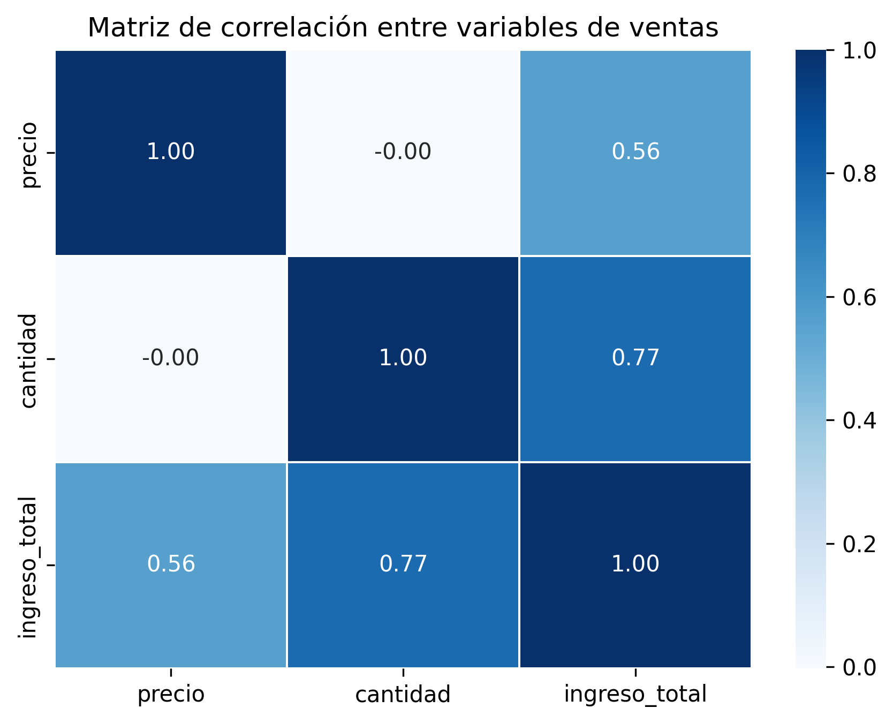

# 📊 Análisis Exploratorio de Ventas y Marketing


> **Proyecto de Data Analytics desarrollado en Python**
>
> Limpieza de datos • Integración • Estadística descriptiva • EDA • Correlación • Visualización • Storytelling

---

# 📌 Resumen del proyecto

Este proyecto fue desarrollado como trabajo integrador del **Taller de Data Analytics**.

El objetivo fue analizar información de ventas, clientes y campañas de marketing para comprender el comportamiento comercial, detectar patrones y obtener información útil para la toma de decisiones mediante un proceso completo de análisis de datos.

---

# 📘 Notebook

Análisis completo desarrollado en Google Colab:

[▶ Abrir Notebook en Google Colab](https://colab.research.google.com/drive/1SlyufwWf6CZNrkMH1MEektI798JrW0jq?usp=sharing)

---

# 🌐 Demo

Página web del proyecto:

[Ver página en GitHub Pages](https://francomamaniramirez.github.io/analisis-ventas-marketing/)

---

# 📈 Métricas del proyecto

| Indicador | Valor |
|-----------|------:|
| Registros analizados | **2.998** |
| Datasets utilizados | **3** |
| Variables analizadas | **15+** |
| Visualizaciones realizadas | **5** |
| Herramientas utilizadas | **8** |
| Notebook principal | **1** |

---

# 📑 Índice

- Descripción
- Objetivos
- Preguntas de análisis
- Conjunto de datos
- Tecnologías utilizadas
- Metodología
- Principales hallazgos
- Visualizaciones
- Conclusiones
- Estructura del proyecto
- Cómo ejecutar el proyecto
- Próximas mejoras
- Autor

---

# 📖 Descripción

Durante el desarrollo se implementó un flujo completo de trabajo en Data Analytics:

- Recopilación de datos.
- Limpieza de datos.
- Transformación.
- Integración de datasets.
- Estadística descriptiva.
- Análisis Exploratorio de Datos (EDA).
- Análisis de correlación.
- Visualización de resultados.
- Elaboración de conclusiones.

El resultado es un proyecto reproducible que combina análisis estadístico y visualizaciones para interpretar el comportamiento de las ventas y evaluar el impacto de las campañas de marketing.

---

# 🎯 Objetivos

- Analizar el comportamiento de las ventas.
- Comprender la distribución de los ingresos.
- Detectar patrones temporales.
- Estudiar la relación entre precio, cantidad e ingresos.
- Comparar ventas con y sin campañas de marketing.
- Comunicar resultados mediante visualizaciones.

---

# ❓ Preguntas de análisis

El proyecto buscó responder:

- ¿Qué variable explica mejor los ingresos?
- ¿Cómo se distribuyen las ventas?
- ¿Existen meses con mejor desempeño?
- ¿Las campañas generan diferencias en las ventas?
- ¿Qué productos presentan mayor rendimiento?
- ¿Se observan cambios de comportamiento durante el año?

---

# 📂 Conjunto de datos

Se trabajó con tres datasets relacionados:

| Dataset | Descripción |
|---------|-------------|
| **Ventas** | Información de productos, precios, cantidades e ingresos. |
| **Marketing** | Información de campañas publicitarias. |
| **Clientes** | Información demográfica de clientes. |

---

# ⚙️ Tecnologías utilizadas

| Tecnología | Aplicación |
|------------|------------|
| Python | Desarrollo del proyecto |
| Pandas | Limpieza y transformación de datos |
| NumPy | Cálculos estadísticos |
| Matplotlib | Visualizaciones |
| Seaborn | Histogramas, Boxplots y Heatmaps |
| Plotly | Visualizaciones interactivas |
| Google Colab | Desarrollo del Notebook |
| GitHub | Publicación del proyecto |

---

# 🔄 Metodología

```text
Datos originales
        │
        ▼
Carga de datos
        │
        ▼
Limpieza
        │
        ▼
Transformación
        │
        ▼
Integración
        │
        ▼
Análisis Exploratorio (EDA)
        │
        ▼
Correlación
        │
        ▼
Visualización
        │
        ▼
Conclusiones
```

---

# 📊 Principales hallazgos

📌 La **cantidad vendida** presentó la correlación más alta con los ingresos (**0.77**).

📌 El **precio** mostró una correlación positiva moderada (**0.56**).

📌 Se identificó un cambio de tendencia a partir de mayo, donde los ingresos disminuyen y luego permanecen relativamente estables.

📌 Las categorías de productos presentan un comportamiento equilibrado en cantidad de ventas e ingresos.

📌 Las campañas concentran aproximadamente el **77 % de las ventas registradas**, aunque el ingreso promedio por operación prácticamente no varía respecto de las ventas sin campaña.

---

# 📈 Visualizaciones

## Distribución de ingresos



---

## Boxplot de ingresos



---

## Evolución mensual



---

## Correlación



---

## Campañas de marketing


---

# 💡 Conclusiones

Este proyecto permitió desarrollar un proceso completo de análisis de datos, desde la preparación de la información hasta la obtención de conclusiones respaldadas por evidencia estadística y visual.

Los resultados muestran que la cantidad vendida constituye el principal factor asociado al crecimiento de los ingresos, mientras que el precio presenta una influencia moderada.

También se identificó un cambio de comportamiento durante el año y se observó que las campañas favorecen principalmente el aumento del volumen comercial, sin modificar significativamente el ingreso promedio por operación.

En conjunto, el proyecto demuestra cómo un enfoque estructurado de Data Analytics permite transformar datos en información útil para comprender el comportamiento de un negocio y apoyar la toma de decisiones.

---

# 📁 Estructura del proyecto

```text
📦 analisis-ventas-marketing
│
├── index.html
├── README.md
├── LICENSE
│
├── 📁 data
│   ├── ventas.csv
│   ├── marketing.csv
│   └── clientes.csv
│
├── 📁 notebook
│   └── analisis_ventas_marketing.ipynb
│
└── 📁 images
    ├── histograma_ingresos.png
    ├── boxplot_ingresos.png
    ├── evolucion_mensual.png
    ├── correlacion_heatmap.png
    └── campanas_marketing.png
```

---

# 🚀 Cómo ejecutar el proyecto

## Opción 1: Google Colab

Abrir directamente el Notebook:

[▶ Abrir Notebook en Google Colab](https://colab.research.google.com/drive/1SlyufwWf6CZNrkMH1MEektI798JrW0jq?usp=sharing)

---

## Opción 2: Ejecución local

Clonar el repositorio:

```bash
git clone https://github.com/francomamaniramirez/analisis-ventas-marketing.git
```

Instalar dependencias:

```bash
pip install pandas numpy matplotlib seaborn plotly
```

Abrir el notebook:

```text
notebook/analisis_ventas_marketing.ipynb
```

---

# 🚧 Próximas mejoras

- Incorporar métricas de rentabilidad.
- Analizar estacionalidad mediante series temporales.
- Realizar segmentación de clientes.
- Construir un dashboard interactivo.
- Implementar modelos predictivos para estimar ventas futuras.

---

# 👨‍💻 Autor

## Franco Mamani Ramírez

🎓 Estudiante de la Tecnicatura Superior en Ciencia de Datos e Inteligencia Artificial.

---

⭐ Si este proyecto te resultó interesante, podés dejar una estrella al repositorio.
